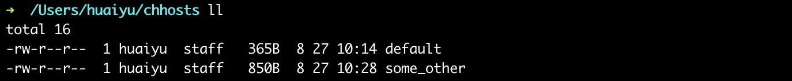
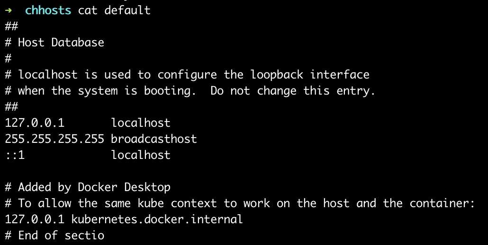
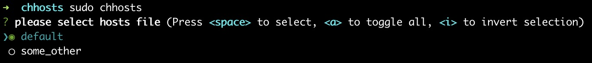

# chhosts

Quickly switch hosts.

## Install

```
npm install -g chhosts
```

## Usage

```
mkdir ~/chhosts
```

```
# put preset hosts file in ~/chhosts

└── chhosts
   ├── some_other
   └── default
```

```
sudo chhosts
```

## Preview








